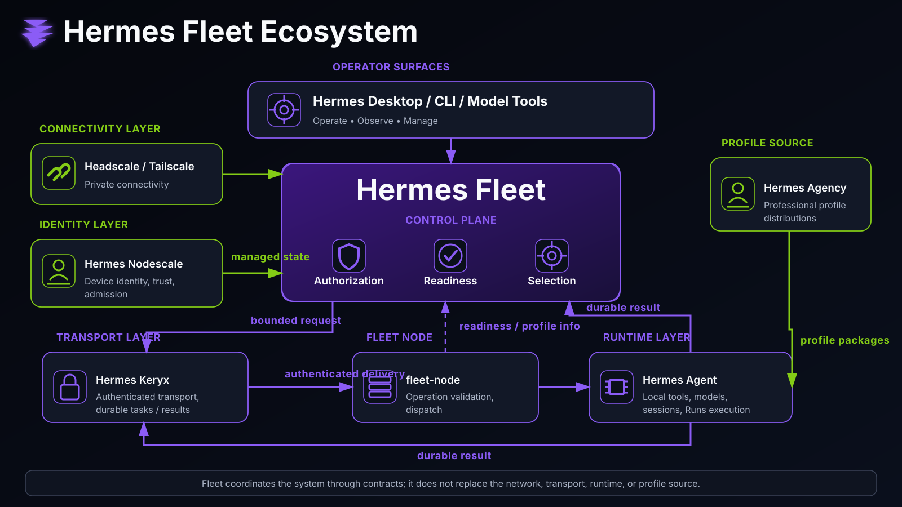
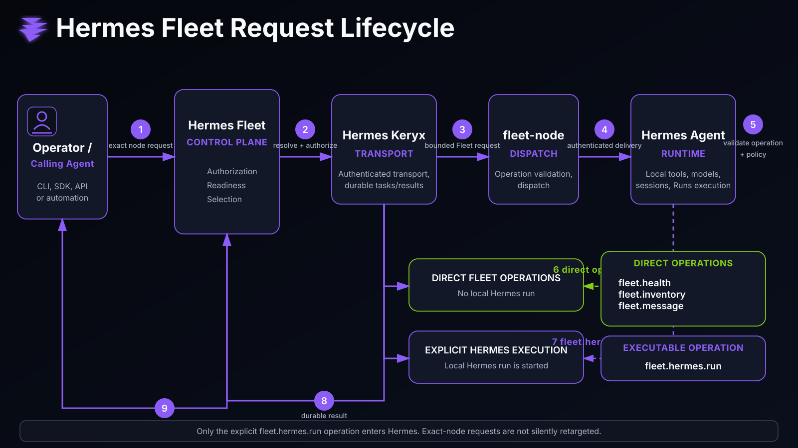
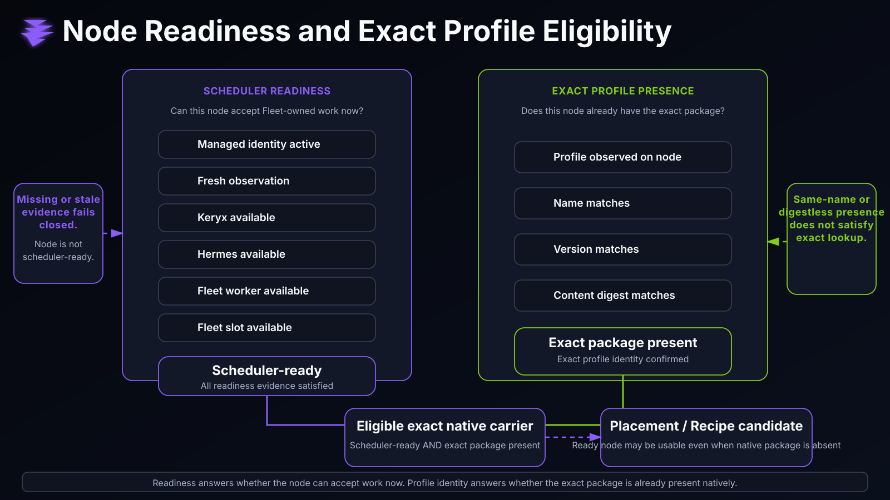
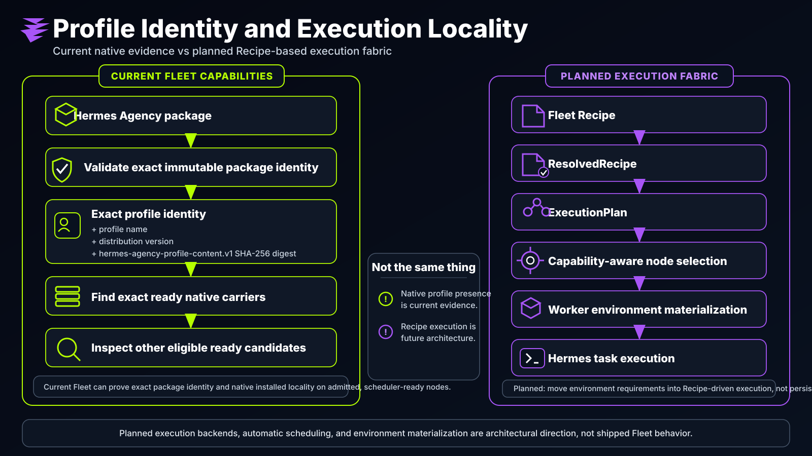

# Hermes Fleet

> **The control plane for distributed Hermes.**
>
> Hermes Fleet turns a collection of Hermes-capable machines into an operator-controlled fleet: one place to understand the network, address exact nodes, enforce Fleet policy, inspect readiness, discover professional profiles, and deliberately run Hermes work across machines.

[](https://github.com/Dadmin88/hermes-fleet/actions/workflows/ci.yml)
[](LICENSE)

## Start here: the whole system at a glance



Hermes already knows how to run an agent on one machine. The surrounding Hermes ecosystem adds private networking, trusted device membership, authenticated transport, professional profiles, and operator UI.

**Fleet is the layer that makes those pieces act like one system without collapsing their responsibilities into one giant service.**

If you are new to the project, the quickest path is:

1. **Look at the ecosystem diagram above.**
2. Read the short responsibility map below.
3. Open the **[full visual guide](docs/visual-guide.md)** for all diagrams in one place.
4. Continue to the **[ecosystem map](docs/ecosystem.md)** or **[architecture guide](docs/architecture.md)** when you need the deeper contracts.
5. Read **[project provenance](docs/provenance.md)** when you want the dated architecture history and immutable milestone links.

### What each project owns

| Project | Owns | Fleet uses it for |
| --- | --- | --- |
| **Headscale / Tailscale** | Private network membership and reachability | Getting machines onto a private network |
| **[Hermes Nodescale](https://github.com/Dadmin88/hermes-nodescale)** | Device identity, explicit trust, lifecycle, Keryx identity binding, managed Fleet projection | Knowing which devices are admitted and which Keryx peer belongs to them |
| **[Hermes Keryx](https://github.com/Dadmin88/hermes-keryx)** | Authenticated peer identity, routing, durable tasks/results, claims, leases, relay delivery, artifacts | Moving Fleet work and results between machines |
| **Hermes Fleet** | Fleet authorization, exact-node addressing, readiness, dispatch, profile presence, placement facts, operator surfaces | Coordinating the distributed system |
| **[Hermes Agent](https://github.com/NousResearch/hermes-agent)** | Local models, tools, skills, profiles, permissions, memory, sessions, Runs execution | Actually doing the AI work on a machine |
| **[Hermes Agency](https://github.com/Dadmin88/hermes-agency)** | Versioned professional Hermes profile distributions and bundled skills | Defining professional worker packages Fleet can identify and observe |
| **Hermes Desktop + Fleet plugin** | Human-facing Fleet presentation and bounded operator actions | Seeing and operating the fleet visually |

> **Fleet coordinates these systems through their contracts. It does not reimplement them.**

Keryx remains the **inter-machine** transport. Nodescale remains the remote device-trust authority. Hermes remains the local execution runtime. Agency remains the professional capability source. Same-machine Fleet execution stays local to Fleet + Hermes rather than taking a Keryx round trip.

---

## Why Fleet exists

A distributed Hermes installation has several different questions to answer:

- Which devices belong to the network?
- Which devices have actually been trusted?
- Which authenticated application peer belongs to each device?
- Which exact machine should an operator address?
- Is that machine alive and ready for another Fleet-owned run?
- Which professional Hermes profiles are installed there?
- Does the installed profile exactly match the package we expect?
- Is the requested Fleet operation allowed?
- How does work move to that machine and return durably?
- What actually starts and executes the local agent run?

Those are **not the same question**, and they should not have the same source of truth.

A useful high-level analogy is **a control plane for Hermes workers**. Fleet has some of the same concerns people associate with cluster orchestrators: node inventory, readiness, placement facts, policy, dispatch, and observability. Fleet is intentionally not a second network, not a second task transport, and not its own container runtime.

---

## The trust chain

Fleet is deliberately built around separate gates:

```text
network reachable
    != device trusted
    != Keryx identity bound
    != Fleet operation authorized
    != node scheduler-ready
    != exact requested profile present
    != permission for arbitrary execution
```

A machine being connected does not make it trusted. A Keryx-authenticated peer is not automatically authorized for every Fleet operation. A node being scheduler-ready does not grant `fleet.hermes.run`. A same-name profile does not prove that the expected Agency package is installed.

Fleet fails closed rather than promoting convenient signals into authority.

---

## What Fleet does today

Fleet currently provides:

- **Stable operator-facing node identity** mapped to immutable Keryx peer identities.
- **Deterministic exact-node selection** for operator-directed work.
- **Bounded, versioned Fleet request envelopes** with absolute deadlines and payload limits.
- **Default-deny per-node authorization** for Fleet operations.
- **Direct node operations** for health, inventory, and bounded messaging.
- **Deliberate remote Hermes execution** through the explicit `fleet.hermes.run` operation.
- **Durable task-to-run binding** so reclaimed Keryx work does not silently create duplicate Hermes runs.
- **Durable status reattachment** through Keryx task/result state.
- **Nodescale-managed Fleet projection** with Fleet-local deny precedence.
- **Current node observations** with freshness, worker capacity, resource facts, and explainable scheduler readiness.
- **Installed Hermes profile observation** as part of current node state.
- **Exact Agency V1 profile content identity** when Fleet can safely prove it.
- **Ready-node lookup by profile**, including exact `{name, version, content_digest}` lookup.
- **Pinned immutable Hermes Agency package validation** at an exact repository revision.
- **Read-only candidate discovery** over currently admitted, scheduler-ready nodes.
- **Durable, backend-owned Workflow definitions and immutable revisions** for authoring; workflow execution remains unavailable.
- **CLI, Hermes model tools, an operator skill, Hermes Desktop integration, and deployment assets.**

### Planned, not shipped yet

Fleet does **not** currently claim:

- the complete persistent Hermes-backed Agent Instance lifecycle;
- immutable RunAuthority as the sole source of temporary execution power;
- temporary Run Capsule lifecycle and recovery;
- runtime-neutral Fleet Recipe execution;
- automatic placement winner selection;
- Fleet-owned hardened disposable per-run execution bodies;
- scoped memory/skill promotion and context-firewall guarantees;
- Templar pre-execution and learning gates;
- Vault-backed temporary secret handling;
- a structured host-action broker;
- a general CPU/GPU workload scheduler;
- executable distributed workflow graphs;
- persistent automatic remote Agency profile installation;
- a second mailbox, relay, or transport system;
- proven end-to-end cancellation of an already-running remote Hermes run.

The frozen vNext direction is **durable brain, disposable body**: a persistent Hermes Agent Instance keeps its Agency base and authorized learning, while each execution receives immutable RunAuthority, a temporary Fleet Run Capsule, and a Fleet-owned disposable runtime that drives Hermes through native `/v1/runs`. Same-machine work stays local; Nodescale/Keryx enter only for actual cross-machine identity, trust, transport, reconciliation, or distributed coordination. See **[vNext foundation](docs/vnext-foundation.md)**.

---

## What happens when you run work remotely?



A normal exact-node request follows a simple authority-preserving path:

1. The operator or calling agent asks Fleet to target an exact node.
2. Fleet resolves that target and applies Fleet authorization.
3. Keryx carries the bounded request durably to the authenticated destination peer.
4. `fleet-node` validates the operation, deadline, destination, sender context, and local policy.
5. Direct operations stay inside Fleet.
6. Only `fleet.hermes.run` deliberately enters the local Hermes Runs path.
7. Results return durably through Keryx and can be reattached after restart.

Fleet does not silently retarget an exact-node request to another machine when the requested destination is unavailable.

### Current operation vocabulary

| Operation | Starts Hermes? | Purpose |
| --- | ---: | --- |
| `fleet.health` | No | Bounded Fleet, Keryx, and local Hermes capability health |
| `fleet.inventory` | No | Safe node identity, capability, readiness, resource, and observed-profile summary where available |
| `fleet.message` | No | Bounded text communication with deterministic acknowledgement |
| `fleet.hermes.run` | **Yes** | Deliberately start and observe one authenticated local Hermes run |

Receiving a Fleet message never implies permission to start Hermes.

Peer-originated content remains untrusted data even when Keryx authenticated the sender. Authentication proves **who delivered it**, not that returned text, fields, or model-generated content should become local authority.

---

## Nodes, readiness, and exact profile eligibility



A node can be known to Fleet without being usable for work.

Fleet derives scheduler readiness from separate facts:

1. Nodescale-managed identity is currently active.
2. The latest Fleet observation is fresh.
3. Required network/control reachability is observed.
4. Keryx is available.
5. Hermes is available.
6. The Fleet worker is available.
7. At least one Fleet-owned execution slot remains.

That means a node can legitimately be managed but offline, alive without Hermes, healthy but saturated, carrying a useful profile but stale, or scheduler-ready while not carrying the requested profile.

Readiness is **derived**, not stored as a magical `ready=true` authority bit.

Profile identity is a second question. A node only qualifies as an **exact native carrier** when it is scheduler-ready **and** its current observation proves the requested exact package identity.

See **[Node observations and scheduler readiness](docs/node-readiness.md)**.

---

## Professional profiles, exact identity, and execution locality



[Hermes Agency](https://github.com/Dadmin88/hermes-agency) supplies professional Hermes profile distributions: engineers, designers, researchers, reviewers, operators, writers, and other specialized roles with bundled skills.

For the current native execution path, Hermes installs and runs those profiles locally. Fleet can answer the distributed evidence question:

> **Which admitted, ready machines currently report the exact profile package I need?**

For supported Agency packages, the strongest current identity is:

```text
profile name
+ distribution version
+ hermes-agency-profile-content.v1 SHA-256 digest
```

That lets Fleet distinguish the exact approved package from a same-name package with different content, a legacy or generic installation without a provable exact digest, or no current installation at all.

### Current native locality vs planned vNext execution

Current Fleet can:

```text
requested Agency package
        ↓
validate exact immutable package identity
        ↓
find exact ready native carriers
        ↓
inspect other eligible ready candidates
```

The frozen vNext direction keeps Recipe/ResolvedRecipe/ExecutionPlan as runtime-neutral planning inputs, then binds execution to a persistent Hermes brain and a disposable Fleet-owned body:

```text
Fleet Recipe / ResolvedRecipe / ExecutionPlan
        ↓
placement + local admission
        ↓
Persistent Hermes Agent Instance
        ↓
Immutable RunAuthority
        ↓
Temporary Run Capsule
        ↓
Fleet-owned disposable execution body
        ↓
Hermes native /v1/runs
        ↓
finalization / quiescence
        ↓
destroy body; preserve Agent Instance
```

That planned model does not require every professional profile to be permanently installed on every candidate host and does not turn Agency identity into per-run authority. Recipe execution, persistent Agent Instance semantics, hardened disposable execution bodies, automatic scheduling, and the broader vNext security/learning layers remain **planned architecture, not shipped Fleet behavior**.

See **[Profile identity, presence, and execution locality](docs/profile-placement.md)**.

---

## Fleet Desktop and durable Workflows

Fleet includes a Hermes Desktop integration for operating the system visually.

The Desktop surface presents validated Fleet state rather than frontend guesses. It can show managed and observed machines, readiness evidence, worker capacity, resources, profile presence, operator-facing topology, and supported actions without turning UI layout into authority.

Provider-visible machines remain visibly different from trusted/admitted managed machines.

Workflow definitions are now **durable, backend-owned, and immutably versioned authoring documents**. Workflow execution is still unavailable. A line drawn in the editor does not become a distributed execution graph merely because it is persisted.

See **[Fleet Desktop](docs/desktop.md)** and **[Fleet Canvas topology](docs/canvas.md)**.

---

## Install Fleet as a Hermes plugin

Fleet is a Hermes plugin. This quick start assumes Git is authorized for the repository and that the supporting Keryx/runtime services required by your deployment are available.

```bash
hermes plugins install Dadmin88/hermes-fleet --enable
hermes fleet init
hermes plugins list --plain --no-bundled
```

If a Hermes gateway is already running, restart it after installing or updating Fleet so the process loads the current Fleet tools:

```bash
hermes gateway restart
```

`hermes fleet init` creates missing Fleet state without overwriting valid operator-managed state.

For a real multi-machine deployment, follow **[Deployment](docs/deployment.md)** rather than treating plugin installation as the entire stack.

---

## Operator CLI

```text
hermes fleet init
hermes fleet list
hermes fleet show NODE
hermes fleet health NODE
hermes fleet inventory NODE
hermes fleet message NODE "TEXT" [--topic TOPIC] [--correlation-id ID]
hermes fleet run NODE "PROMPT"
hermes fleet status TASK_ID
hermes fleet cancel TASK_ID
```

Examples:

```bash
# Inspect the fleet
hermes fleet list
hermes fleet show compute-a

# Check a node
hermes fleet health compute-a
hermes fleet inventory compute-a

# Send a bounded Fleet message
hermes fleet message compute-a "ready for the next task?"

# Deliberately start Hermes work on that exact node
hermes fleet run compute-a "Review the current branch and summarize the risks."
```

Cross-node running-task cancellation currently fails closed because Fleet cannot yet prove that the destination worker observed cancellation and stopped an already-bound Hermes run.

### Hermes model tools

Fleet also exposes model-callable tools:

- `fleet_list_nodes`
- `fleet_get_node`
- `fleet_get_health`
- `fleet_send_message`
- `fleet_run`
- `fleet_get_task`
- `fleet_cancel_task`

The same authorization and trust boundaries apply whether a human or another agent initiated the operation.

---

## Repository layout

Fleet currently includes both the proven Python plugin/runtime and a growing Rust implementation under one product contract.

```text
hermes_fleet/           Python Fleet plugin/runtime and integration surfaces
crates/fleet-domain/    Rust domain types, authorization, observations, readiness
crates/fleet-state/     Rust durable Fleet-owned state and read-only queries
crates/fleet-control/   Rust local managed-state / observation / workflow control
desktop/                Hermes Desktop Fleet plugin
dashboard/              dashboard integration surface
fixtures/               language-neutral compatibility fixtures
ops/                    service and deployment assets
proofs/                 bounded cross-component proof harnesses
docs/                   durable public documentation and visual assets
tests/                  Python/unit/integration contract coverage
AGENTS.md                coding-agent architecture and repository guidance
SKILL.md                 Hermes operator skill
```

The Python implementation remains an operational integration and compatibility reference while Rust owns an increasing share of the permanent domain, state, and control foundation.

Externally meaningful contracts matter more than which language currently implements them.

---

## Documentation map

New to Fleet? Read these in order:

| Document | Use it when... |
| --- | --- |
| **[Project provenance](docs/provenance.md)** | You want the dated architecture history and immutable evidence links |
| **[Visual guide](docs/visual-guide.md)** | You want all four architecture diagrams in one place |
| **[Ecosystem map](docs/ecosystem.md)** | You want to understand the whole Hermes system and how the repositories fit together |
| **[Architecture](docs/architecture.md)** | You need Fleet's internal trust, state, request, and execution boundaries |
| **[Profile identity and locality](docs/profile-placement.md)** | You are working with Hermes Agency profiles, exact package identity, native presence, or future Recipe placement |
| **[Node readiness](docs/node-readiness.md)** | You need to understand liveness, freshness, capacity, resources, or scheduler readiness |
| **[Managed projection V1](docs/managed-projection-v1.md)** | You are integrating Nodescale-managed device state into Fleet |
| **[Deployment](docs/deployment.md)** | You are setting up controller, worker, Keryx, and Hermes services |
| **[Fleet Desktop](docs/desktop.md)** | You are operating or developing the Desktop integration |
| **[Fleet Canvas](docs/canvas.md)** | You are working on topology or durable Workflow authoring |
| **[Integration verification](docs/smoke-test.md)** | You need repeatable real two-node verification |
| **[AGENTS.md](AGENTS.md)** | You are a coding agent or maintainer changing cross-repository contracts |
| **[SKILL.md](SKILL.md)** | You are operating Fleet from Hermes |
| **[CHANGELOG.md](CHANGELOG.md)** | You need release history |
| **[CITATION.cff](CITATION.cff)** | You want machine-readable project attribution metadata |

The complete documentation index is in **[docs/README.md](docs/README.md)**.

---

## Development

Python:

```bash
python -m pytest
python -m ruff check .
python -m ruff format --check .
```

Rust:

```bash
cargo fmt --all -- --check
cargo clippy --workspace --all-targets -- -D warnings
cargo test --workspace
cargo build --workspace
```

Use the language-neutral fixtures when changing behavior shared by Python and Rust.

For changes that cross repository boundaries, run the relevant real integration/proof path rather than considering isolated unit tests sufficient.

Coding agents should read **[AGENTS.md](AGENTS.md)** before changing architecture or cross-component contracts.

---

## Design principles

Fleet tries to preserve a few boring-but-powerful rules:

- **Exact identities over convenient names.** Friendly names are presentation; immutable identities carry authority.
- **Explicit trust over network proximity.** Connected is not trusted.
- **Authorization stays local to the application boundary.** Transport authentication is not Fleet permission.
- **Readiness is evidence, not optimism.** Missing or stale facts fail closed.
- **No duplicate infrastructure for convenience.** Keryx owns transport and durable task state.
- **Orchestrate mature runtime primitives instead of recreating them.** Planned execution backends should wrap proven infrastructure rather than turn Fleet into a homegrown runtime.
- **Do not trust acknowledgements as proof of side effects.** Durable observed state should prove important mutations.
- **Current product and future architecture are documented separately.** A roadmap idea is not a shipped capability.

Those rules are what keep Fleet a control plane instead of letting it slowly become a distributed monolith.

---

## License

Hermes Fleet is licensed under the GNU Affero General Public License v3.0 only (`AGPL-3.0-only`). See [LICENSE](LICENSE).

Code published in earlier commits under a different license remains available under the terms that applied when it was published.