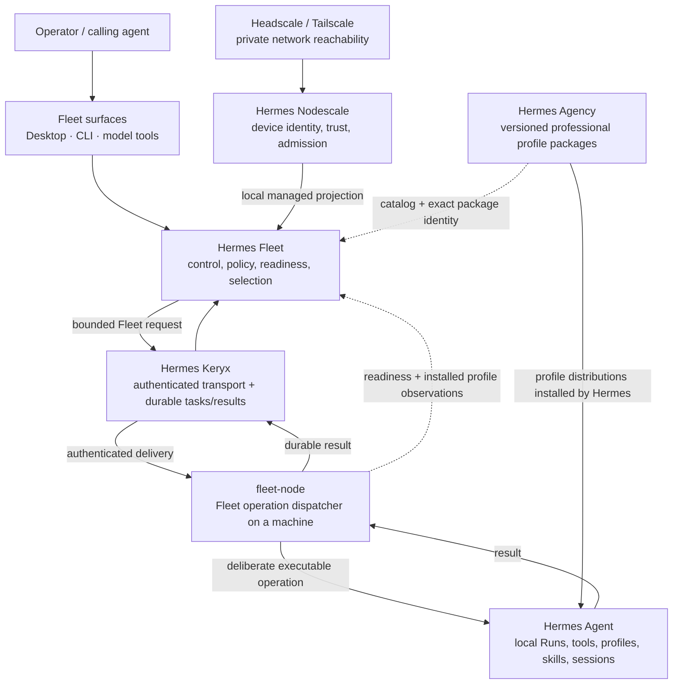
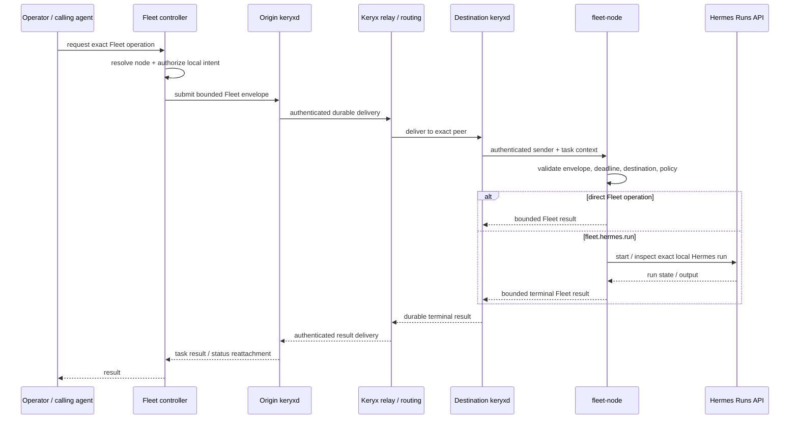

# Hermes Fleet ecosystem map

Hermes Fleet is the **control plane for a distributed Hermes installation**. It does not replace the network, the transport, the agent runtime, or the professional profiles that run on top of Hermes. Fleet connects those layers, keeps their authorities separate, and gives an operator one place to understand and control the system.

This page is the best starting point when the repository names are familiar but the full map is not.

For the frozen **vNext planned architecture**, read [vNext foundation](vnext-foundation.md) first. In particular, vNext makes the machine boundary explicit: same-machine execution stays local to Fleet + Hermes, while Nodescale/Keryx enter only for real cross-machine identity, trust, transport, reconciliation, or distributed coordination.

## The short version

Think of the ecosystem as a stack of deliberately separate responsibilities:

- **Headscale / Tailscale** provides private network reachability.
- **Nodescale** decides which physical or virtual device has joined, whether it is trusted, and which Keryx identity belongs to it.
- **Hermes Keryx** authenticates application peers and moves durable work, results, and artifacts **between machines**. It is not the same-machine execution path.
- **Hermes Fleet** owns authorization, admission, placement/scheduling, immutable RunAuthority, temporary Run Capsules, disposable runtime lifecycle, grants, host-action authority, learning-promotion policy, Templar orchestration, and audit/provenance as those vNext contracts land.
- **Hermes Agent** performs the actual local agent work and owns persistent Agent Instances, native profiles, `/v1/runs`, models, tools, approvals, sessions, memory/skill primitives, process evidence, and finalization/quiescence.
- **Hermes Agency** supplies immutable professional capability bases, profile definitions, bundled skills, and exact pinned source material.
- **Templar** is a low-authority evaluator that may return `ALLOW`, `DENY`, or `REVIEW`; it never grants or widens authority.
- **Vault** owns secret bodies, versions/rotation, scoped references, and temporary run handles.
- **Hermes Desktop + the Fleet plugin** gives operators a visual control surface over authoritative Fleet state.

No layer is allowed to quietly impersonate another layer's authority.

## Ecosystem at a glance



The diagram has two different kinds of relationships:

1. **Authority and runtime flow**: network membership, trust, transport, Fleet authorization, and Hermes execution.
2. **Capability supply and observation**: Agency defines profile packages; Hermes can install them in the current native runtime; Fleet observes their presence and exact identity.

Agency is therefore part of the ecosystem, but it is **not another trust or transport authority**.

## Repository map

| Layer | Repository / project | Owns | Does not own |
| --- | --- | --- | --- |
| Private connectivity | Headscale / Tailscale | Private network membership, addresses, reachability | Fleet authorization, Keryx peer identity, Hermes execution |
| Device trust | [Hermes Nodescale](https://github.com/Dadmin88/hermes-nodescale) | Provider-device correlation, stable device identity, membership, explicit trust, principal/device trust relationships, Keryx binding, cross-machine identity projection | Task transport, local execution, Fleet RunAuthority |
| Inter-machine transport | [Hermes Keryx](https://github.com/Dadmin88/hermes-keryx) | Authenticated peer identity, routing, durable remote tasks/results, claims, leases, bounded redelivery, relay delivery, artifacts | Same-machine execution or application-level execution authority |
| Control plane | **Hermes Fleet** | Authorization, admission, placement/scheduling, reservations, RunAuthority, Run Capsules, disposable runtime lifecycle, grants, host-action authority, learning-promotion policy, Templar orchestration, audit/provenance | Agent brain storage, secret bodies, device trust, inter-machine transport, a homegrown container runtime |
| Execution | [Hermes Agent](https://github.com/NousResearch/hermes-agent) | Persistent Agent Instances, native profiles, local Runs, models/providers, tools, approvals, sessions, memory/skill primitives, interruption, process evidence, finalization/quiescence | Cross-machine Fleet policy, transport, or device trust |
| Professional capabilities | [Hermes Agency](https://github.com/Dadmin88/hermes-agency) | Immutable professional capability bases, profile definitions, bundled skills, exact pinned source material | Live node state, temporary run authority, transport, node selection |
| Security evaluator | Templar | Low-authority `ALLOW` / `DENY` / `REVIEW` evaluation bound to exact requests/candidates | Granting authority, operating nodes, arbitrary tools, Fleet/Keryx/Docker control |
| Secret custody | Vault | Secret bodies, versioning, rotation, scoped references, temporary run handles | Agent identity, execution policy, or model-visible authority |
| Operator UX | Fleet Desktop plugin in this repository | Presentation of authoritative Fleet state and bounded operator actions | New authority invented by the UI |

### The key architectural sentence

**Fleet coordinates the ecosystem by consuming the contracts of the other layers, not by reimplementing them.**

If a change would make Fleet maintain its own parallel transport queue, infer device trust from an address, or treat an Agency profile as live node authority, it is crossing a boundary on purpose and requires an explicit architecture decision.

## The authority chain

The safest way to understand Fleet is as a sequence of gates.

```text
network reachable
    != device trusted
    != Keryx identity bound
    != Fleet operation authorized
    != node currently scheduler-ready
    != exact requested profile package present
    != permission to execute arbitrary work
```

Each statement answers a different question.

| Question | Source of truth |
| --- | --- |
| Can packets reach this machine on the private network? | Headscale / Tailscale provider state |
| Which real device is this, and has its owner trusted it? | Nodescale |
| Which application peer sent or received this transport operation? | Keryx authenticated runtime identity |
| May that peer invoke this Fleet operation on this node? | Fleet local authorization policy |
| Is the node currently alive and able to accept another Fleet-owned run? | Fleet managed state + current observations + readiness derivation |
| Which Hermes profile distributions are actually installed here? | Hermes profile installation observed by the Fleet node |
| Does an installed profile exactly match an approved Agency package? | Profile name + version + exact content digest |
| What executes the prompt, tools, skills, and session? | Hermes Agent |

This separation is not ceremony. It prevents a convenient but unsafe shortcut in one layer from becoming authority everywhere else.

## What Fleet itself contains

Fleet has both controller-side and node-side responsibilities.

### Operator / controller side

The controller surface resolves human-facing node names, applies local policy, creates bounded Fleet request envelopes, submits work through Keryx, and reattaches to durable task state.

Operator entry points include:

- the `hermes fleet ...` CLI;
- Fleet model tools exposed through Hermes;
- the Hermes Desktop Fleet plugin;
- Fleet's local APIs and state services used by supported integrations.

### Worker side

A machine that receives Fleet work runs `fleet-node`. It receives authenticated delivery context from Keryx, validates the Fleet envelope and local authorization, and dispatches the requested operation.

Direct operations such as health, inventory, and message acknowledgement stay inside Fleet. Only the explicit executable operation `fleet.hermes.run` enters the local Hermes Runs path.

### Durable Fleet state

Fleet keeps only the state that belongs to its own authority:

- operator inventory and local policy;
- Nodescale-managed projection state;
- one current operational observation per managed node;
- exact observed Hermes profile presence as part of that observation;
- narrow Keryx-task-to-Hermes-run bindings needed for restart-safe execution correlation.

For cross-machine work, Keryx remains the durable transport/task ledger. Hermes remains the local execution system, and same-machine Fleet work does not require a Keryx task merely to reach Hermes.

## How Nodescale enters Fleet

Nodescale is the admission and trust layer for managed devices.

A normal managed-device lifecycle is:

```mermaid
flowchart LR
    join["Device joins private network"]
    correlate["Nodescale correlates exact provider device"]
    identity["Stable Nodescale DeviceId"]
    trust["Owner explicitly trusts device"]
    bind["Keryx proves application peer identity"]
    project["Nodescale projects bounded managed state"]
    observe["Fleet receives current worker observation"]
    ready["Fleet derives readiness"]

    join --> correlate --> identity --> trust --> bind --> project --> observe --> ready
```



The projection from Nodescale into Fleet is a **local authenticated control path**. It does not ride through Keryx and it does not write Fleet's database directly.

Nodescale can establish bounded managed baseline state, but it does not automatically grant `fleet.hermes.run`. Fleet-local deny policy remains authoritative.

## How Keryx enters Fleet

Keryx is the wire and durable task substrate under cross-node Fleet operations.

A typical request travels like this:



Fleet does not silently retarget an exact request to a different machine when the selected node is unavailable.

## How Agency enters Fleet

Hermes Agency is a **capability catalog and profile distribution source**. It is not a remote worker registry.

An Agency profile packages a professional role for Hermes, including its role definition and bundled skills. Hermes owns current native profile installation and execution. Fleet owns the distributed evidence question: **which admitted, ready machines currently report which exact profile package?**

Fleet's merged profile-awareness foundation currently provides:

- bounded discovery of installed Hermes profile distributions on a Fleet node;
- observed profile presence carried with the node's current operational observation;
- exact Agency V1 content identity when Fleet can safely compute it;
- deterministic lookup of scheduler-ready nodes that advertise a requested profile;
- exact lookup by profile name, optional version, and content digest;
- a pinned Agency snapshot boundary tied to an exact git commit and validated package identity;
- deterministic read-only candidate discovery for scheduler-ready admitted nodes.

These are current observation and lookup contracts. They do not create a persistent remote profile installer, choose a scheduling winner, or authorize execution.

The frozen vNext direction uses exact Agency package identity as an immutable capability-base input to a persistent Hermes Agent Instance. Fleet Recipes and ExecutionPlans can inform placement/materialization, but temporary execution power comes only from exact RunAuthority and a temporary Run Capsule. A compatible node can materialize the disposable execution body without requiring the professional profile to be permanently installed on that host first.

Persistent automatic host profile installation is not the default planned completion path for distributed profile availability.

See [Profile identity, presence, and execution locality](profile-placement.md) for the precise current and planned boundary.

## Profile identity: name is not enough

For exact Agency matching, Fleet treats a package as more than a friendly profile name.

The strongest currently supported observed identity is:

```text
profile name
+ distribution version
+ hermes-agency-profile-content.v1 SHA-256 digest
```

The digest covers behavior-bearing profile content such as the role definition, skills, relevant configuration, cron content when present, bundled-skill marker state, and executable-bit semantics.

That distinction lets Fleet tell the difference between:

- the exact approved package already being present;
- a same-name package with different content;
- a legacy or generic distribution whose exact Agency content identity cannot be proven;
- no installed package with that name.

A digestless or mismatching package can still be reported as installed profile presence, but it cannot satisfy an **exact** Agency package lookup.

## Readiness and profile presence are separate

A node can be scheduler-ready while not carrying the requested profile. It can also carry the requested profile while being stale, unreachable, saturated, or otherwise not ready.

Fleet therefore keeps these decisions separate:

1. **Readiness** answers whether the machine can currently accept Fleet-owned execution.
2. **Profile presence** answers what Hermes profile packages the current observation reports.
3. **Exact profile lookup** asks which ready nodes already carry the exact desired package.
4. **Candidate lookup** asks which other ready admitted nodes could be considered by a future explicit placement policy.

The current candidate query deliberately does not rank or choose a winner. Scheduling policy belongs to a separately defined layer rather than being smuggled into state inspection.

## What an operator actually does

### Inspect the fleet

Use Fleet Desktop or the CLI to see managed nodes, observations, readiness, and the current operator-facing topology.

```text
hermes fleet list
hermes fleet show NODE
hermes fleet health NODE
hermes fleet inventory NODE
```

### Communicate with an exact node

```text
hermes fleet message NODE "TEXT"
```

Fleet resolves the configured name to an exact Keryx peer identity. The transport is Keryx; the operation permission is Fleet.

### Deliberately run Hermes on an exact node

```text
hermes fleet run NODE "PROMPT"
```

This uses the explicit `fleet.hermes.run` capability. Mesh membership, Nodescale trust, Keryx authentication, or profile presence alone never imply permission to start it.

### Add a managed machine

At a high level:

1. provide private-network connectivity;
2. enroll and explicitly trust the device through Nodescale;
3. bind the device to its authenticated Keryx peer identity;
4. project managed state into Fleet;
5. run the Fleet/Keryx/Hermes services required by that node;
6. wait for fresh Fleet observation evidence before treating the node as scheduler-ready.

See [Deployment](deployment.md), [Managed projection V1](managed-projection-v1.md), and [Node observations and scheduler readiness](node-readiness.md).

### Make a professional profile available today

For the current native execution path, install the desired Hermes profile distribution using Hermes' supported profile tooling. The Fleet node observation path will report the installed profile identity on its normal cadence.

Fleet can then inspect native profile locality and exact package identity. The planned Recipe execution path is separate and must not be presented as shipped behavior until its contracts and proofs are merged.

## Current product versus architectural direction

The ecosystem is being built in layers. Documentation must distinguish a merged contract from a design direction.

### Current Fleet contracts

- exact named-node operations over Keryx;
- default-deny Fleet authorization;
- deliberate local Hermes Runs execution;
- Nodescale managed projection;
- strict read-only Nodescale operator-control consumption for durable device authority inspection;
- current node observations and explainable scheduler readiness;
- installed Hermes profile presence and exact Agency V1 content digests when safely provable;
- general and exact ready-profile lookup;
- pinned Agency snapshot/package validation;
- read-only eligible candidate lookup;
- Fleet Desktop operator surfaces and durable backend-owned Workflow authoring revisions; execution remains unavailable.

### Planned, not current

- runtime-neutral Fleet Recipes;
- backend-specific validated ExecutionPlans;
- heterogeneous execution-backend capability matching;
- automatic explainable node selection;
- disposable task workers and environment materialization;
- cache/stage/ready worker locality optimization;
- executable distributed workflow graphs;
- proven end-to-end cancellation of an already-running cross-node Hermes run.

Persistent automatic host profile installation is neither current nor the default planned path for making a missing professional profile available on another node.

## A useful map for coding agents

When changing this ecosystem, start by asking **which repository owns the fact I am about to change?**

| If you are changing... | Start in... | Fleet should consume it through... |
| --- | --- | --- |
| Device join/trust/revocation | Nodescale | managed projection / supported observation contracts |
| Authenticated peer routing or task durability | Keryx | public Keryx daemon/SDK contracts |
| Fleet operation authorization | Fleet | Fleet domain/policy contracts |
| Node readiness or placement facts | Fleet | Fleet managed state + current observations |
| Local model/tool/session execution | Hermes Agent | authenticated local Hermes integration |
| Professional role/profile package content | Hermes Agency | versioned Hermes profile distributions + validated package identity |
| Operator presentation | Fleet Desktop plugin | validated Fleet Desktop/API models |

Do not solve a missing contract by reaching into another component's SQLite database or by promoting presentation data into authority.

Repository-specific instructions for coding agents live in [`../AGENTS.md`](../AGENTS.md).

## Where to read next

- [Architecture](architecture.md): Fleet's internal authority, request, state, and deployment boundaries.
- [Profile identity, presence, and execution locality](profile-placement.md): Agency integration, current native profile evidence, and the planned Recipe boundary.
- [Node observations and scheduler readiness](node-readiness.md): how Fleet decides whether a node is currently ready.
- [Managed projection V1](managed-projection-v1.md): the Nodescale-to-Fleet contract.
- [Nodescale operator control V1](nodescale-operator-control.md): Fleet's strict read-only client for Nodescale-owned durable device authority.
- [Deployment](deployment.md): controller, worker, Keryx, and Hermes service topology.
- [Fleet Desktop](desktop.md): the current operator application surface.
- [Fleet Canvas topology](canvas.md): graph presentation and workflow-editor authority boundaries.