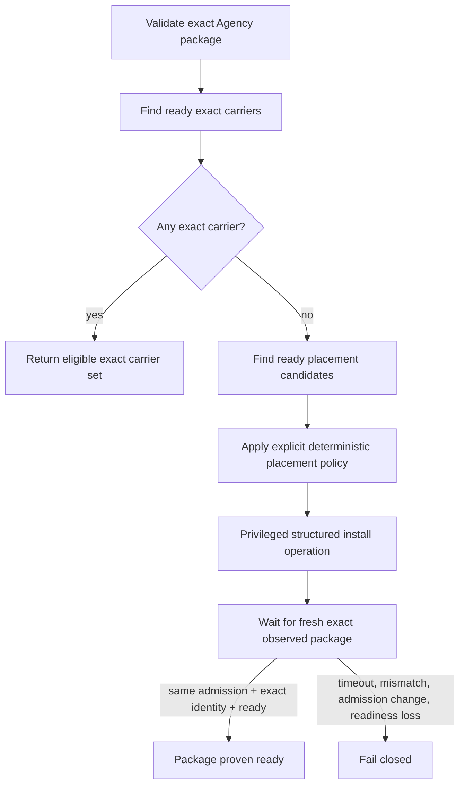

# Profile identity and placement

Hermes Fleet treats professional profiles as **distributed capabilities whose live presence must be proven on real nodes**.

Hermes Agency defines and distributes the professional profile packages. Hermes Agent installs and executes them. Fleet observes what is actually installed on each managed node, ties that evidence to node readiness and admission, and provides the read-only foundations for exact locate-or-place behavior.

The important split is:

> **Agency owns profile content. Fleet owns live distributed placement truth.**

This document describes the current merged profile-awareness and placement foundations. It also names the missing mutation boundary so users and coding agents do not mistake an in-progress architecture for a shipped automatic installer.

## Why profile placement needs its own contract

A request such as "use the backend engineer" contains at least three independent questions:

1. Which professional profile does the request mean?
2. Which nodes currently have that exact package installed and are ready to work?
3. If none do, which node is eligible to receive it, and how can installation be performed and proven safely?

Hermes Agency answers the first question through its versioned catalog and profile distributions. Fleet answers the live-node portions of the second question. Fleet now has the read-only building blocks needed for the third, but automatic remote installation and final target choice are not yet current product behavior.

## Responsibility split

| Concern | Owner |
| --- | --- |
| Professional role definition | Hermes Agency `SOUL.md` |
| Bundled role-specific procedures | Hermes Agency profile `skills/` |
| Distribution identity and package metadata | Hermes Agency |
| Installing a profile into a local Hermes installation | Hermes Agent profile tooling |
| Detecting installed distributions on a Fleet node | Hermes Fleet node observation path |
| Current managed-node admission | Nodescale projected into Fleet |
| Current node readiness and Fleet-owned capacity | Hermes Fleet |
| Authenticated cross-node delivery | Hermes Keryx |
| Exact ready-node profile lookup | Hermes Fleet state |
| Automatic remote profile installation | **Not yet a current Fleet operation** |
| Final locate-or-place target policy | **Not yet a current Fleet coordinator contract** |

Agency is intentionally not a live presence registry. It does not need to know which laptops, desktops, VPS hosts, or remote workers currently carry its profiles.

## The three levels of profile identity

Fleet can encounter profile presence at different confidence levels.

### 1. Name

Example:

```text
agency-backend-engineer
```

A name is useful for general capability discovery, but it is not enough to prove exact package content.

### 2. Name + distribution version

Example:

```text
agency-backend-engineer
0.1.0
```

Version narrows identity further, but a version string by itself still does not prove that behavior-bearing package bytes are the approved bytes.

### 3. Name + version + content digest

For Agency V1 packages whose behavior-bearing content can be read safely, Fleet computes the `hermes-agency-profile-content.v1` digest.

The exact identity becomes:

```json
{
  "name": "agency-backend-engineer",
  "version": "0.1.0",
  "content_digest": "<64 lowercase SHA-256 hex characters>"
}
```

That is the identity used by Fleet's strongest exact-profile lookup.

## What the Agency V1 digest represents

Fleet's installed-profile scanner computes a deterministic SHA-256 digest over the profile's behavior-bearing package content. The digest schema is:

```text
hermes-agency-profile-content.v1
```

The material includes the profile identity plus supported behavior files such as:

- `SOUL.md`;
- files under `skills/`;
- `config.yaml` when present;
- `mcp.json` when present;
- cron content when present;
- `.no-bundled-skills` when present;
- executable-bit semantics for included files.

The scanner is bounded by profile count, manifest size, file count, per-file size, and total bytes. Unsafe, ambiguous, changing, over-bound, or non-Agency-shaped distributions are not assigned a fabricated exact digest.

A generic profile can therefore remain visible as `{name, version}` while omitting `content_digest`.

## Installed profile observation

Installed profile discovery runs as part of the existing Fleet node observation path. Fleet does not introduce a second profile-presence daemon or registry.

A current observation can express:

- no observation at all, so profile presence is unknown;
- a current observation with an empty profile list;
- a current observation containing one or more canonical installed profile identities.

Conceptually:

```text
no current observation
    -> profile presence unknown

current observation + profiles=[]
    -> node explicitly reports no discovered profile distributions

current observation + profiles=[...]
    -> node reports the listed installed distributions
```

Profile presence inherits the same admission and freshness boundaries as the observation that carries it. A stale or pre-readmission observation is not transformed into current placement authority.

## Readiness is not profile identity

Scheduler readiness and profile presence answer different questions.

A node may be:

```text
ready + exact package present
ready + same-name package but wrong digest
ready + requested package absent
not ready + exact package present
```

Fleet therefore never treats `scheduler_ready=true` as proof that the desired professional profile exists.

Likewise, an exact installed package does not make a node eligible when its observation is stale, Keryx is unavailable, Hermes is unavailable, the Fleet worker is unavailable, or Fleet-owned execution capacity is exhausted.

## Current lookup layers

Fleet state exposes progressively stronger read-only queries.

### General profile lookup

A general profile query asks for scheduler-ready nodes that report a profile name, optionally at an exact version.

Use this when the caller cares about an installed distribution identity but does not require an exact Agency content digest.

The query does not substitute another professional profile when the requested profile is missing.

### Exact profile lookup

Exact lookup requires the requested profile content digest and can also require the exact distribution version.

It returns only currently admitted, fresh, scheduler-ready nodes whose observation proves the requested identity.

Digestless or mismatching packages do not satisfy exact lookup.

### Placement-candidate lookup

When no exact ready carrier exists, Fleet can query the set of currently scheduler-ready admitted nodes that could be considered as profile placement targets.

Each candidate carries the facts needed by a later policy layer, including:

- managed source/network/device identity;
- current admission generation;
- available Fleet worker slots;
- current scheduling resource observations;
- same-name installed profile presence when one exists;
- the current readiness explanation.

The query intentionally returns **all eligible candidates in deterministic order**. It does not rank them and does not select a winner.

That separation keeps state inspection from quietly becoming an undocumented scheduler.

## Pinned Agency source snapshots

Automatic placement requires stronger source trust than "clone the current main branch and install whatever is there."

Fleet therefore has a pinned Agency snapshot boundary that binds an approved repository to an **exact full git object ID**. A resolved placement package is tied to that immutable checkout rather than a mutable branch or tag.

The current merged snapshot flow validates, among other things:

- the approved repository identity;
- an exact full git revision;
- the checked-out revision;
- bounded supported Agency catalog metadata;
- the supported `hermes-agency-profile-content.v1` digest schema;
- deterministic profile roster and identity;
- safe profile distribution paths;
- selected `distribution.yaml` name/version;
- an independently recomputed content digest for the selected profile package.

A snapshot resolves an `AgencyProfilePackage` without installing it anywhere.

### Important current security boundary

The current merged snapshot implementation runs the pinned checkout's bounded Agency catalog generator while validating the snapshot. It is suitable only for explicitly approved Agency source repositories and exact revisions under the current contract.

Do not generalize this interface into an arbitrary repository/package executor. Any future remote installation path should continue tightening source validation rather than accepting user-supplied git URLs or shell text.

## What "locate" can mean today

Fleet already has the data needed to answer questions such as:

```text
Which ready nodes report agency-backend-engineer?
```

and, with an exact package identity:

```text
Which ready nodes report this exact
{name, version, content_digest} package?
```

That is genuine distributed placement knowledge because it is derived from current admitted node observations rather than an Agency-side guess.

## What "place" does not mean yet

Fleet does not currently expose a completed remote profile-install operation.

There is no shipped Fleet request that says "install this validated Agency package on node X" and then proves through a fresh observation that installation succeeded.

There is also no current coordinator that:

1. resolves a trusted exact Agency package;
2. short-circuits when an exact ready carrier already exists;
3. chooses one placement candidate according to a defined policy;
4. invokes a privileged structured remote install operation;
5. waits for the same active admission to report the exact expected package;
6. routes later work only after that observation proof succeeds.

Those are the remaining pieces of complete locate-or-place behavior.

## Safety properties for the future mutation path

The existing read-only foundation deliberately constrains how remote placement should be completed.

Any future install operation should preserve these rules:

- profile installation is privileged and default-deny;
- Keryx authenticates transport, but Fleet still authorizes the install operation;
- a task cannot nominate an arbitrary repository URL to install;
- a prompt cannot smuggle arbitrary shell commands into profile installation;
- source identity remains bound to an approved repository and exact immutable revision;
- the selected profile name, version, path, and digest remain bound to the validated package;
- Hermes remains the native local profile installer;
- installer exit code or remote response text is not proof of placement;
- Fleet must observe the exact expected package after installation;
- observation proof must belong to the same active admission generation;
- readiness loss, admission change, timeout, or mismatching content must fail closed.

These properties keep "place a professional profile" from degenerating into "remote arbitrary code/package execution."

## Why admission generation matters

Nodescale-managed admission can change across disable, removal, revocation, or re-admission.

Fleet observations are fenced by the current projection/admission generation. When managed state changes, old evidence cannot be reused as if it came from the new admission epoch.

That matters especially for placement:

```text
install request sent under admission generation N
    ↓
node is disabled or re-admitted as generation N+1
    ↓
old generation-N profile observation arrives late
```

The late observation must not complete placement for generation N+1.

The existing observation/state model already supplies this fence. A future locate-or-place coordinator should consume it rather than inventing a separate placement identity system.

## Why the install response is not enough

A remote process can exit successfully while the desired runtime state is still absent, incomplete, replaced, or different from what the controller intended.

Fleet's architecture therefore separates:

```text
command acknowledgement
```

from:

```text
observed exact runtime state
```

The intended completion proof for placement is the latter: a fresh Fleet observation from the same admitted node proving the exact package identity and current readiness.

## Example reasoning flow

Suppose a future task requires `agency-backend-engineer` from a pinned Agency snapshot.



The left side of this flow through placement-candidate discovery is largely present as read-only foundation. The privileged install, winner policy, and post-install coordinator path are not yet a current Fleet product surface.

## Guidance for operators

If you need a profile available on a node today:

1. install the profile with supported Hermes profile tooling on the intended machine;
2. allow the Fleet node observation loop to refresh;
3. inspect Fleet readiness/profile presence rather than assuming installation succeeded globally;
4. use exact content identity when the workflow requires an exact approved Agency package.

Do not treat a same-name profile or an old observation as an exact-placement guarantee.

## Guidance for coding agents

When modifying profile placement, preserve this source-of-truth order:

```text
approved immutable Agency package
        ↓
Hermes local installation
        ↓
Fleet node observation
        ↓
Fleet durable current state
        ↓
readiness / exact-profile query
        ↓
placement or routing decision
```

Do not:

- make Agency maintain a live Fleet node registry;
- make Nodescale select professional profiles;
- make Keryx decide profile-install authorization;
- trust remote installer stdout as placement proof;
- read Hermes, Keryx, or Nodescale private databases as a shortcut;
- rank placement candidates inside the persistence query;
- silently substitute a different profile when the requested identity is unavailable.

See [`../AGENTS.md`](../AGENTS.md) for the repository-wide agent contract.

## Related documentation

- [Ecosystem map](ecosystem.md)
- [Architecture](architecture.md)
- [Node observations and scheduler readiness](node-readiness.md)
- [Managed projection V1](managed-projection-v1.md)
- [Deployment](deployment.md)
